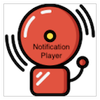

 Signal K - Notification Player w/ Webapp
=================================

This plugin plays user configurable sounds and/or text to speech when a Signal K notification enters emergency/alarm/warn/notice state.
Custom notifications can also be sent to user configured slack channel.  The paired Webapp displays all known/configured notifications as well as 
controls for silencing and clearing active notification states.


The playback options for each state (emergency,alarm,warn,notice) can be configure independently with the option to create custom playback rules for a specific path & state.  Custom commands can be initiated before and after a notification plays (eg. pause music, change volume, flash lights).

A state's notification playback can be configured to repeat continuously (eg. emergency) or output a one time notification sound + speech (eg. notice).  Continuous playback stops when a notification's state returns to 'normal' or 'sound' is removed from its method (muted/silenced).  All notifications are queued in order and play the sound first followed by a message/speech if available, repeating as configured.  

Example usage: a zone for a elevated coolant or alternator temperature could trigger a single play/speech event while an overheat zone would send a continuous output/alarm.  A similar setup could be used for depth or battery SOC.  An anchor alarm would be customized to play continously, perhaps with a unique attention grabbing sound alternating with 'Anchor Alarm - Emergency' text to speech.

### Initial configuration of each notification state 


Customized alarm for specific path & notification state


### WebApp - State Viewer and Control

Companion webapp for viewing all notifications states and their corresponding values.  This page can be easily embedded into Kip for quick state view and playback control/silencing  


Mouse over any path to view its notifcation zones and type  


Mouse over the State column of any path (eg. normal) to view log of past notifications.


### API - Control of Playback & Active Notifications
Active notifications can be silenced (sound removed from method) or resolved (state set to normal) via a simple GET of the following URLs

Silence all active playback (clears sound notification method)
```
curl http://localhost:3000/plugins/signalk-notification-player/silence
```
Resolve all active notifications (set state to normal)
```
curl http://localhost:3000/plugins/signalk-notification-player/resolve
```
Disable all playback for 1 hour (default), max 8hr.
```
curl http://localhost:3000/plugins/signalk-notification-player/disable
```
Custom disable all playback for 5 minutes ( max value 28800 / ie 8hrs )
```
curl http://localhost:3000/plugins/signalk-notification-player/disable?300
```
Custom disable playback for specific path (args: path & true/false )
```
curl http://localhost:3000/plugins/signalk-notification-player/disablePath?electrical.batteries.House.voltage?true
```
List all known notifcation states & associated value (json)
```
curl http://localhost:3000/plugins/signalk-notification-player/list
```
List log of notifications (json) (log?path?numberDisplayed)
```
curl http://localhost:3000/plugins/signalk-notification-player/log?navigation.gnss.horizontalDilution?25
```
While playback is disabled, incoming notifications will still be queued and played in order, once re-enabled the latest / current notification for a given path will be processed for playback.

Example using authentication data with user pi
```
curl -H 'Cookie: JAUTHENTICATION='$(signalk-generate-token -u pi -e 1y -s ~pi/.signalk/security.json)  http://localhost:3000/plugins/signalk-notification-player/silence
```

Silence, Resolve and Disable functions are availble via these corresponding paths which can be set via the included webapp, webapps like Kip's boolean control panel or NodeRed :
```
digital.notificationPlayer.silence  (clear sound method from all active notifications)
digital.notificationPlayer.resolve  (set all active notifications to normal)
digital.notificationPlayer.disable  (will reset/enable playback after 60min)
```
(Set above path prefix under Plugin Config - default: digital.notificationPlayer )
Example of alarm playback control via the Kip Webapp


### Background
A Signal K path can have one or more zones associated with it. Zones are specified in a path's meta data which can be defined/edited using SK Data Browser /w Meta Data enabled, or generated by plugins like signalk-anchoralarm-plugin.  
When a Signal K path's value (eg. environment.depth.belowSurface = 3) enters the range specified in a zone, the state of its associated notification is updated. This state update could trigger this plugin to play an audio notification/text to speech.  
Webapps like KIP can be used to silence or resolve active notifications.  
(note: zones defined by the older @signalk/zones plugin has issues with KIP if entries are 'Active'. To migrate zone configuration from @signalk/zones plugin to use SK server directly, click edit and then save for each path with a zone shown under SK Data Browser. Then disable then @signalk/zones plugin.)


## Dependencies

* Working speaker connected to your computer running Signal K
* Sound player:  `afplay (mac), omxplayer, mpg321 & mpg123` (linux & win)
* Linux specific speech synthesis dependencies: `festival festvox-kallpc16k`

## Supplied Sounds

* builtin_alarm.mp3
* builtin_notice.mp3
* builtin_sonar.mp3
* builtin_tritone.mp3


## Release Notes

- version 2.5.0:  
  - Feature: Persistant log of state changes, viewable WebApp mouse over State
- version 2.4.0:  
  - Feature: Ability to disable/mute individual notifcation paths, state saved between restarts
- version 2.2.0:  
  - Feature: Custom delay before playing notifications to help with bouncing zone states
  - Fix: major refactor of event Q logic, adding fail safe features to assure all notifications are played
- version 2.1.0:  
  - Feature: Webapp now controls and shows playback status (if disabled).
  - Fix: get notifications manually at startup as subscription missing notifications.
- version 2.0.1:  
  - Fix: issue with instant notification subscription missing notifications at startup, get notifications manually for webapp
- version 2.0:  
  - Feature: New companion webapp for viewing all notifications states and their corresponding values 
  - Feature: webapp silence & resolve functions per notification & silence all button
- version 1.9:  
  - Feature: to silence & resolve notifications as well as disable playback (with max timeout reset) accessed via curl/GET
  - Feature: new SK paths to allow digital switching control of these new silence, resolve & disable features.
  - Change: ignore bouncing rate configuration for emergency & alarm states - always play.
- version 1.8:  
  Feature: Slack support added for customize notifications. Update config layout.
- version 1.7:  
  Feature: Option to limit notification rate when bouncing in/out of a zone (eg. tank or depth zone)
- version 1.5.x:  
  Added custom features for each path, new mellow tritone sound, allow active notification to update if message changes

